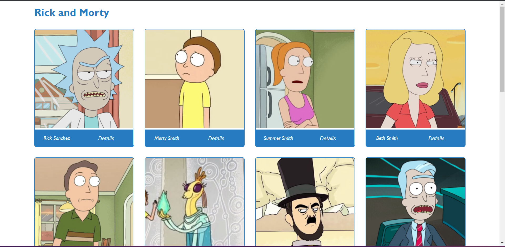

# Rick and Morty

> Rick and Morty is a American adult animated science-fiction sitcom. This web application fetches data from the rick and morty API and allows user to know more about each character in the sitcom. This web application is built with React and Redux. 

## Built With 

- React
- Redux/Redux Toolkit
- Jest

## Live Demo

[Live Demo Link](https://rickkyandmorty.netlify.app/)

# Website image

## Set up(To get a local copy up and running follow these simple example steps.)
* Clone this repo : https://github.com/aneallaryea100/Rick_Morty.git
* Run npm install if you don't have node.js installed on your computer.
* Run npm run build and npm start in your terminal to get the project running.

## Tech ⌘⇧
- **HTML & CSS best practices:** Correct use of tags, elements, properties and syntax.
- **Gitflow:**  Correct use of Branches for deployment and features development.
- **REACT:**  Used to set the basic structure.
- **REDUX:** Centralizing application's state.
- **MARVEL-API:** Fetching data.
- **Webpack:**  Source development for production bundling.
- **Linters Check:** Local and Pull Request Github workflows to check for stylistic errors, bugs and syntax errors in code.

## AUTHOR
👤 Aneal Laryea
* Github: [@aneallaryea](https://github.com/aneallaryea100)
* LinkdIn: [@aneallaryea](https://www.linkedin.com/in/nii-aneal-84ba7a147)
* Twitter: [@aneallaryea](https://twitter.com/AnealLaryea)
## 🤝 Contributing

Contributions, issues, and feature requests are welcome!

Feel free to check the [issues page](../../issues/).

## VIDEO ABOUT THE PROJECT
[LOOM VIDEO](https://www.loom.com/share/23931d53e3024e3a82273aa223b6190a)

## Show your support

Give a ⭐️ if you like this project!

## Acknowledgments
- Rick and Morty API
- Hat tip to anyone whose code was used
- Special thanks to my friends Alzubaire, Karla and Natasha whao are always to give me feedbacks.

## Design Template
* I give credit to [Nelson Sakwa](https://www.behance.net/sakwadesignstudio) the [author of the original design](https://www.behance.net/gallery/31579789/Ballhead-App-(Free-PSDs))

## 📝 License

This project is [MIT](./LICENSE) licensed.

_NOTE: we recommend using the [MIT license](https://choosealicense.com/licenses/mit/) - you can set it up quickly by [using templates available on GitHub](https://docs.github.com/en/communities/setting-up-your-project-for-healthy-contributions/adding-a-license-to-a-repository). You can also use [any other license](https://choosealicense.com/licenses/) if you wish._
